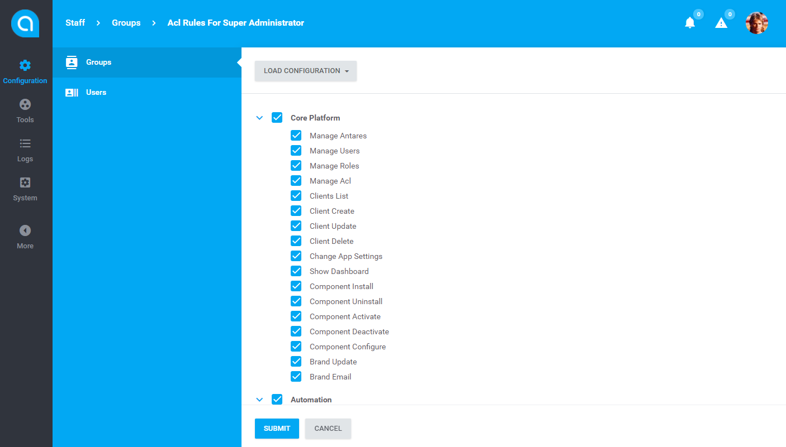

# Antares Acl Module

Acl is a lightweight role-based permissions module for Antares. It is designed to manage user access to resources located in different sections of the application. It sets up permissions based on module rules. It provides  NIST Level 2 Hierarchical Role Based Access Control (RBAC). It also provides an interface for administator to manage user roles (ACL configuration).   

## Documentation

Antares Acl Module documentation [docs.antaresproject.io/php-framework/core-modules/acl](http://www.docs.antaresproject.io/php-framework/core-modules/acl).

Full Antares documentation can be found at [docs.antaresproject.io/php-framework/](http://www.docs.antaresproject.io/php-framework/).

## Changelog

Antares Acl Module changelog can be found in release notes [docs.antaresproject.io/php-framework/getting-started/changelog#acl](http://www.docs.antaresproject.io/php-framework/getting-started/changelog#acl).

You can find full Antares changelog in Antares Documentation [docs.antaresproject.io/php-framework/getting_started/changelog](http://www.docs.antaresproject.io/php-framework/getting-started/changelog).

## Issues

The issue list of this repo is **exclusively** for bug reports and feature requests.

Please follow [Issue Reporting Guide](http://www.docs.antaresproject.io/php-framework/getting-started/issues-reporting-guide/) before opening an issue. Issues not following the guide will be closed without further investigation.

## Contribution

Please follow [Contribution Guide](http://www.docs.antaresproject.io/php-framework/getting-started/contribution-guide/) before making a pull request.

## Community

* Twitter: @antaresproject
* Forum: (coming soon)
* Blog: (coming soon)
* Email: contact (at) antaresproject.io

## License

This software is released under the BSD 3-Clause License.

© 2017 INBS.Software.
